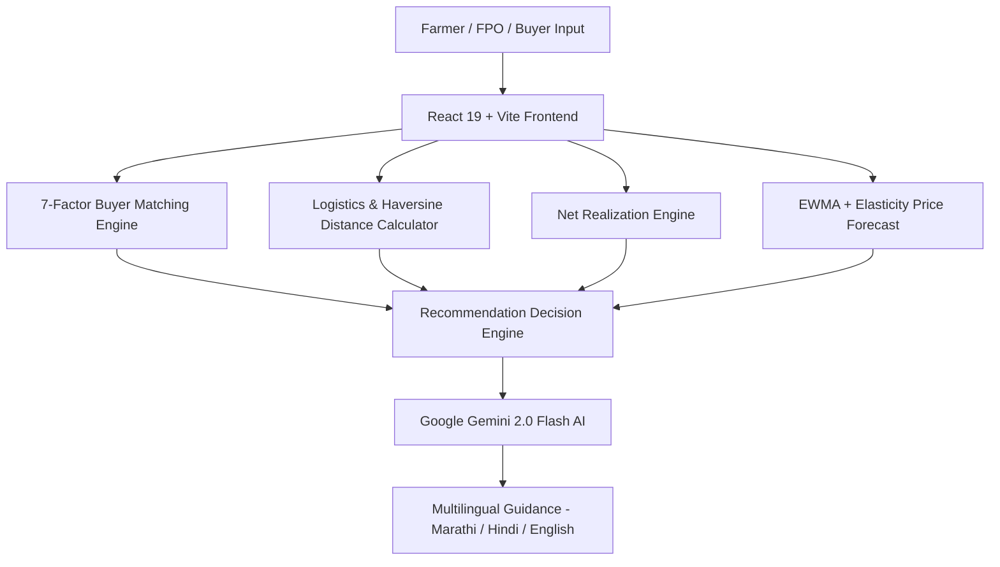

<div align="center">
  
  
  # 🌾 FasalMitr AI (फसलमित्र)
  ### Smart Agricultural Market Intelligence & Direct Price Discovery Platform
  
  [](https://react.dev/)
  [](https://www.typescriptlang.org/)
  [](https://vitejs.dev/)
  [](https://tailwindcss.com/)
  [](https://ai.google.dev/)
  [](LICENSE)

  **SIH Problem Statement ID:** SIH26132 | **Primary Region:** Maharashtra, India (Akola, Washim, Amravati, Buldhana)
</div>

---

## 📌 Executive Summary

**FasalMitr AI** is an intelligent agricultural market linkage and decision-support platform designed for smallholder farmers, Farmer Producer Organizations (FPOs), and institutional buyers in India.

Existing agri-portals only display raw mandi prices without accounting for transportation freight, daily warehouse storage fees, quality deductions, or temporal price trajectories. FasalMitr resolves this gap by focusing on **Net Realization**:

$$\text{Net Realization} = \text{Selling Price} - \text{Logistics Freight} - \text{Storage Fees} - \text{Handling Charges}$$

> **Core Value Proposition:** *"Highest Selling Price ≠ Highest Profit."* FasalMitr guides farmers on **where, when, and to whom** to sell their produce to maximize actual net bank payout.

---

## 🌟 Key Features

### 1. 🤖 Multilingual Gemini 2.0 Flash AI Advisor (मराठी / Hindi / English)
- **Conversational Assistant:** Embedded interactive AI widget supporting queries in **Marathi (मराठी)**, **Hindi (हिंदी)**, and **English**.
- **Devanagari Intent Recognition:** Automatically detects Marathi script and agricultural terminology (e.g. *बाजारभाव, हमीभाव, साठवणूक, निव्वळ नफा*).
- **Explainable AI Recommendations:** Generates transparent, numbers-accurate justifications for sell-vs-hold decisions and buyer matches.
- **Fail-Safe Fallback:** Features a domain-smart fallback engine that computes offline contextual answers if the Gemini API key is missing or offline.

### 2. 💡 Net Realization Calculator
- Computes true net realization per quintal across multiple selling channels.
- Calculates exact freight based on vehicle capacity (Tata Ace, Eicher 6-Wheeler, 10-Wheeler Multi-Axle) and road distance.
- Prevents unnecessary transport to distant mandis where freight costs wipe out minor price gains.

### 3. 📈 EWMA & Arrival Elasticity Statistical Price Forecasting
- **Exponentially Weighted Moving Average (EWMA):** 24-week baseline smoothing ($\alpha = 0.35$).
- **Trend Velocity:** Linear regression slope computed over recent 6-week arrival windows.
- **Arrival Volume Elasticity:** Models price compression ($-0.12\%$ price impact per $+10\%$ arrival surge above 4-week moving average).
- **7-Day & 14-Day Forward Bands:** Provides confidence intervals (Low / Medium / High Risk).

### 4. 🎯 7-Factor Buyer Matching Algorithm
Evaluates buyer procurement offers against farmer lots using a 100-point weighted score:
- **Crop Compatibility (25 pts)**
- **Quantity Matching (20 pts)**
- **Quality & Moisture Grade Compliance (15 pts)**
- **Price Competitiveness over Mandi Baseline (20 pts)**
- **Haversine Distance Proximity (10 pts)**
- **Required Delivery Window (5 pts)**
- **Buyer Reliability Index & Verification Status (5 pts)**

### 5. 🚜 Dynamic FPO Produce Aggregation
- Pools smallholder lots (e.g., 5 farmers with 15–25 quintals each) into unified bulk orders ($100+$ quintals).
- Unlocks direct bulk buyer contracts and institutional pricing previously unavailable to individual small farmers.

### 6. 🗺️ Spatial Distance & Logistics Engine
- Uses the **Haversine formula** on real APMC mandi latitude and longitude coordinates.
- Applies a **$1.3\times$ road distance multiplier** for Maharashtra state highway terrain.

### 7. 📜 End-to-End Transaction Tracker & Escrow Workflow
- Tracks order lifecycle: `Matched` → `Offer Accepted` → `Produce Dispatched` → `Delivered` → `Paid (Direct DBT / Escrow)`.

---

## 🛠️ Tech Stack & Architecture



| Layer | Technology |
| :--- | :--- |
| **Frontend Framework** | React 19, TypeScript 5.8 |
| **Build System & Dev Server** | Vite 6.2 |
| **Styling & UI** | Tailwind CSS v4, Lucide React Icons |
| **Data Visualization** | Recharts, Motion (Framer Motion) |
| **AI / Intelligence Engine** | Google Gemini API (`@google/genai` unified SDK) |
| **Database & Cloud Storage** | Supabase JS Client |

---

## 🚀 Quickstart Guide

### Prerequisites
- **Node.js** (v18.0 or higher)
- **npm** or **bun**

### Installation

1. **Clone the repository:**
   ```bash
   git clone https://github.com/pushkar156/fasalMitra.git
   cd fasalMitra
   ```

2. **Install dependencies:**
   ```bash
   npm install
   ```

3. **Configure Environment Variables:**
   Create a `.env` file in the root directory:
   ```env
   VITE_GEMINI_API_KEY="your_google_gemini_api_key_here"
   VITE_SUPABASE_URL="your_supabase_url_here"
   VITE_SUPABASE_ANON_KEY="your_supabase_anon_key_here"
   ```

4. **Start the Development Server:**
   ```bash
   npm run dev
   ```
   Open `http://localhost:3000` in your browser.

---

## 📁 Repository Structure

```
fasalMitra/
├── public/
│   ├── logo.jpg                      # Official FasalMitr AI emblem
│   └── favicon.jpg                   # Browser favicon
├── src/
│   ├── components/
│   │   ├── AIChatAdvisor.tsx         # Multilingual Gemini AI Chat (Marathi/EN)
│   │   ├── FarmerDashboard.tsx       # Primary farmer overview & recommendations
│   │   ├── MarketIntelligence.tsx    # Mandi price discovery & trend charts
│   │   ├── NetRealizationCalculator.tsx # Net profit breakdown calculator
│   │   ├── BuyerMarketplace.tsx      # Verified buyer listings & 7-factor match
│   │   ├── SellVsHoldAnalysis.tsx    # Temporal sell vs store AI engine
│   │   ├── FpoAggregationView.tsx    # Dynamic FPO bulk aggregation engine
│   │   ├── TransactionTracker.tsx    # Order lifecycle & escrow settlement
│   │   ├── InteractiveMap.tsx        # Spatial mandi & buyer map
│   │   ├── AdminDashboard.tsx        # Macro state & market analytics
│   │   ├── MyProduceView.tsx         # Produce lot management
│   │   ├── Header.tsx                # Sticky navbar with logo & persona switcher
│   │   ├── Sidebar.tsx               # Navigation sidebar
│   │   ├── AboutProjectModal.tsx     # Project vision modal
│   │   └── DemoTourModal.tsx         # 11-step evaluation walkthrough modal
│   ├── services/
│   │   ├── geminiService.ts          # Gemini 2.0 Flash AI integration & fallbacks
│   │   ├── forecastService.ts        # EWMA + elasticity price forecasting
│   │   ├── matchingService.ts        # 7-factor weighted buyer matching
│   │   ├── realizationService.ts     # Net realization formula engine
│   │   ├── logisticsService.ts       # Haversine distance & vehicle cost model
│   │   ├── fpoService.ts             # Dynamic FPO aggregation clusters
│   │   ├── marketService.ts          # Market price data service
│   │   ├── transactionService.ts     # Order ledger state service
│   │   └── supabaseClient.ts         # Supabase client setup
│   ├── data/
│   │   └── sampleData.ts             # Regional Maharashtra market & buyer datasets
│   ├── types.ts                      # TypeScript domain definitions
│   ├── App.tsx                       # Main application router
│   └── main.tsx                      # React DOM entry point
├── index.html                        # SEO meta tags & HTML entry
├── vite.config.ts                    # Vite bundler configuration
└── package.json
```

---

## 📊 Dataset & Simulation Disclaimer

*This project incorporates realistic sample/synthetic datasets representing regional Maharashtra mandis (Akola, Washim, Amravati, Buldhana, Latur, Lasalgaon) to demonstrate the decision engine. The architecture is built to seamlessly plug into live Agmarknet, e-NAM, and government market data feeds in production.*

---

## 📄 License

This project is open-source under the [MIT License](LICENSE). Developed for **SIH Problem Statement SIH26132**.
